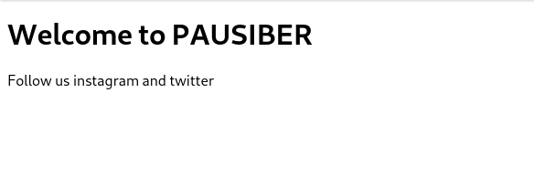

# Hafta 1

**Amaç :** ---

**Yazarlar :** [**hazalsilayaprak**](https://github.com/hazalsilayaprak) **&&** [**aykutsahinler**](https://github.com/aykutsahinler)

---

## HTML Nedir?
**.**
**.**
**.**

### HTML Tag'leri

### `<html>`
Tüm tagleri saran kodlamanın **html** kodları ile yapılması gerektiğini ifade eden başlatıcı tagdir.

```html
<!DOCTYPE html>
<html>
  <head>
    <meta charset="utf-8">
    <title>Page Title</title>
    <link rel="stylesheet" href="style.css">
  </head>
  <body>
    <h1>Welcome to PAUSIBER</h1>
    <p>Follow us instagram and twitter</p>
  </body>
</html>
```

<p align="center">
	
</p>

> örnek not: !!

### `<head>`
**.**
**.**
**.**

#### `<meta>`
**.**
**.**
**.**

#### `<script>`
**.**
**.**
**.**

#### `<title>`
**.**
**.**
**.**

#### `<style>`
**.**
**.**
**.**

#### `<link>`
**.**
**.**
**.**

### `<body>`
**.**
**.**
**.**

#### `<div>` !!
**.**
**.**
**.**

#### `<section>`
**.**
**.**
**.**

#### `<p>`
**.**
**.**
**.**

#### `<h1>, <h2>, ... ,<h6>`
**.**
**.**
**.**

#### `<a>`
**.**
**.**
**.**

#### `<image>`
**.**
**.**
**.**

#### `<iframe>`
**.**
**.**
**.**

#### `<br>`
**.**
**.**
**.**

#### `<hr>`
**.**
**.**
**.**

#### `<ul>, <ol>`
**.**
**.**
**.**

##### `<li>`
**.**
**.**
**.**

#### `<table>`
**.**
**.**
**.**

#### `<form>` !!
**.**
**.**
**.**

---
